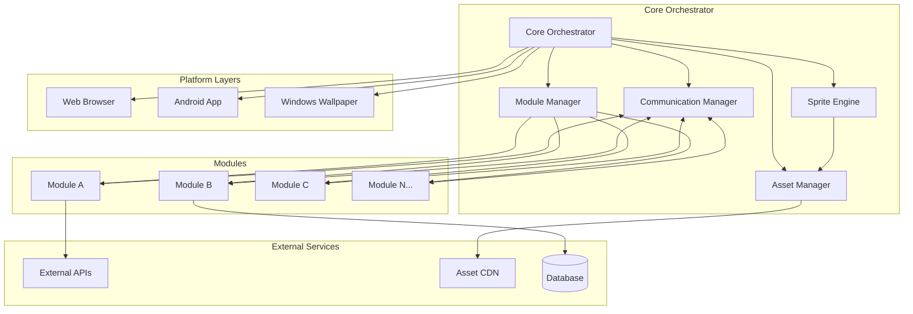
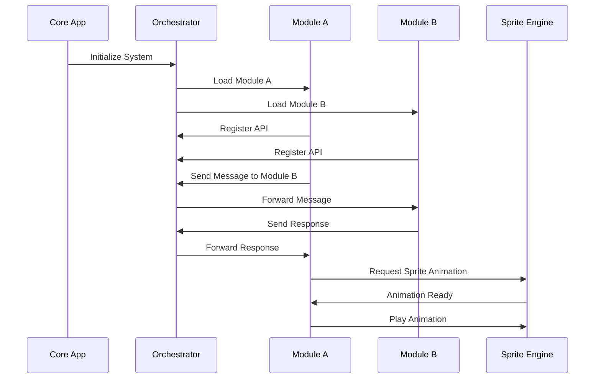
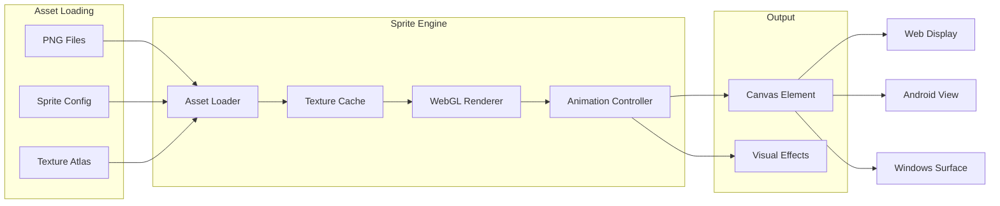
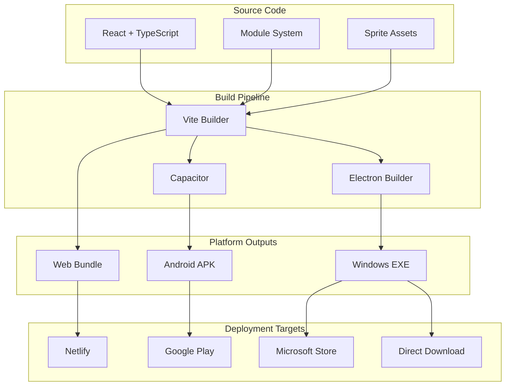
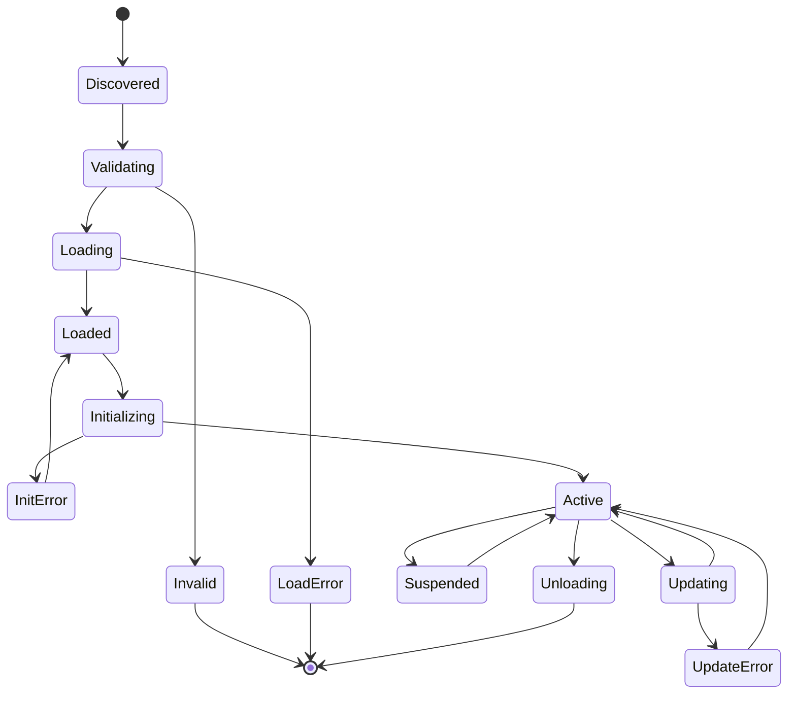
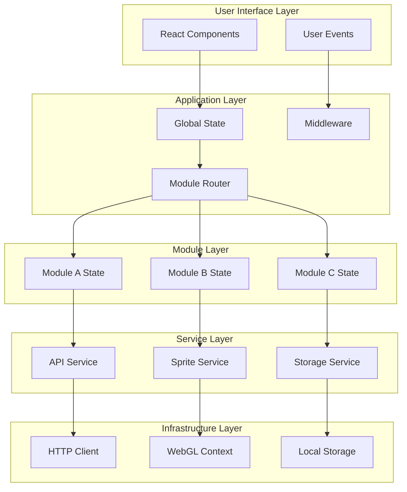
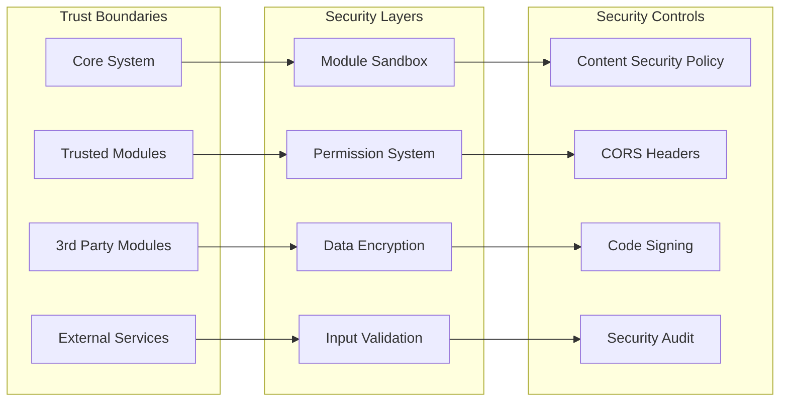
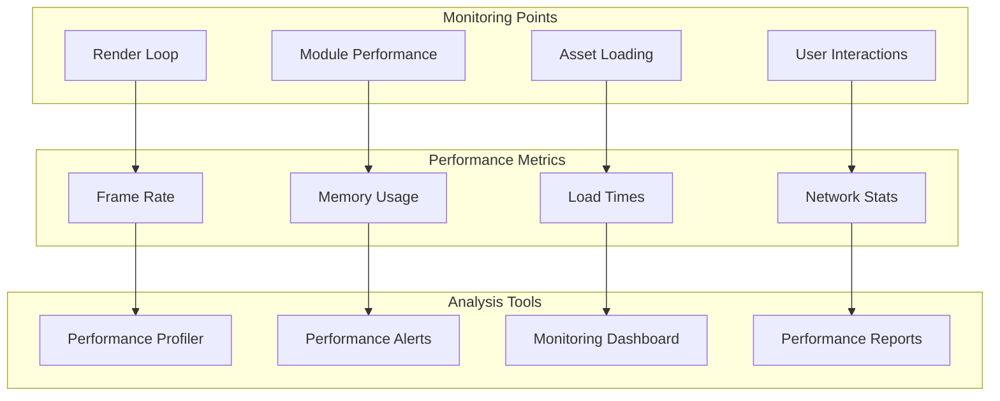
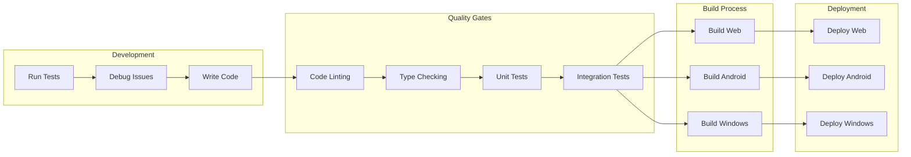
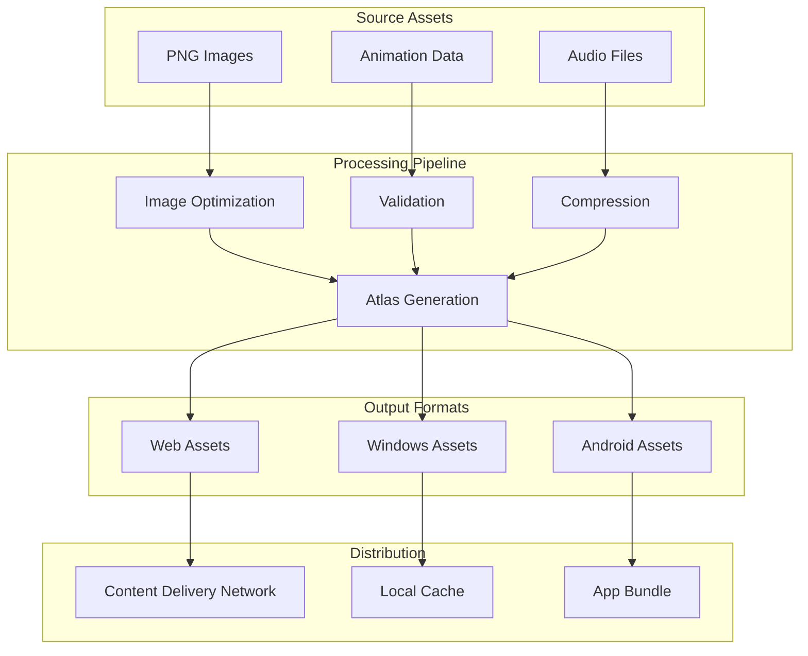

# Architecture Diagrams and Visual Documentation

## System Architecture Overview

## Module Communication Flow

## Sprite Rendering Pipeline

## Platform Deployment Architecture

## Module Lifecycle State Machine

## Data Flow Architecture

## Security Model

## Performance Monitoring Architecture

## Development Workflow

## Asset Pipeline

